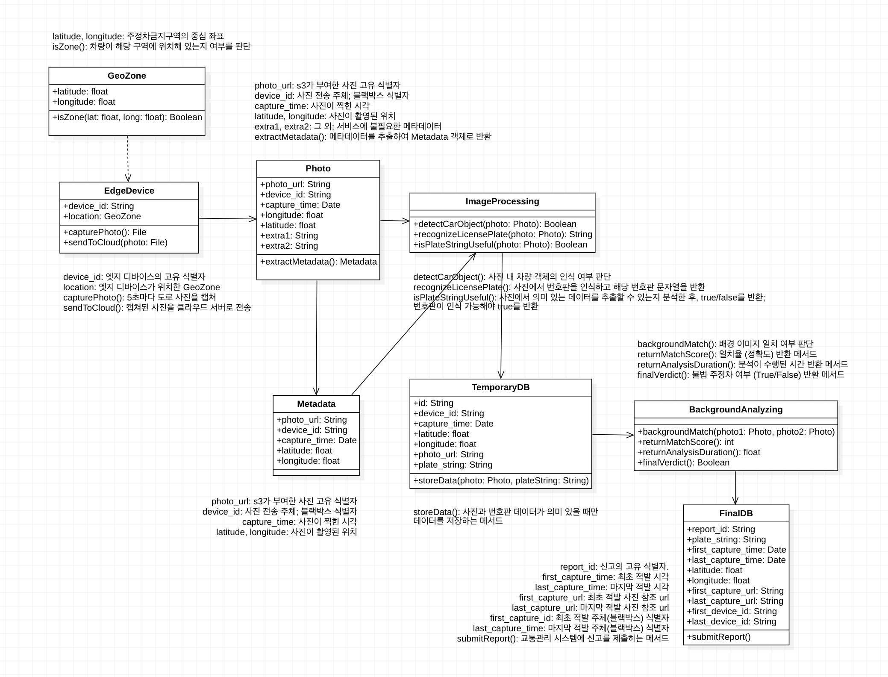
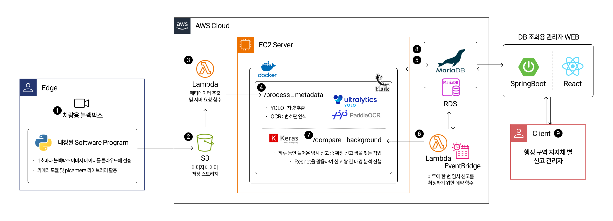
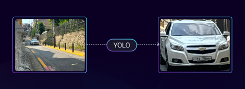
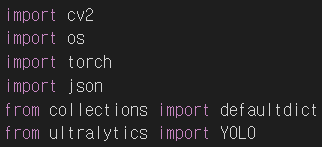
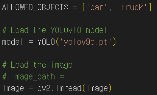
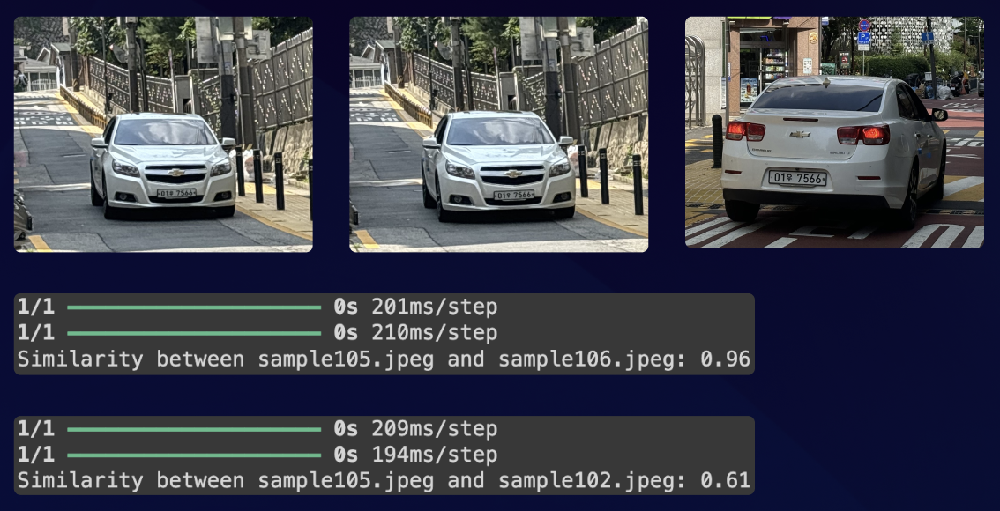
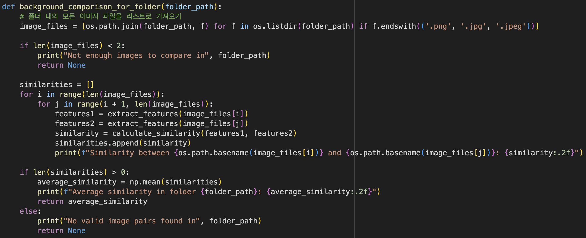

# Team-Info
| (1) 과제명 | Gotcha: 도로안전 개선을 위한 블랙박스 데이터 속 불법주정차 AI 탐지 및 신고 클라우드 서비스
|:---  |---  |
| (2) 팀 번호 / 팀 이름 | 13-AI:D |
| (3) 팀 구성원 | 박소현 (2176143): 리더, 클라우드 아키텍처 설계 김연우 (2183005): 팀원, 클라우드 서버 개발 이희수 (2129030): 팀원, AI 알고리즘 구현 |
| (4) 팀 지도교수 | 심재형 교수님 |
| (5) 팀 멘토 | 오종훈 / 부장,팀장 / 클라우드네트웍스 |
| (6) 과제 분류 | 산학과제 |
| (6) 과제 키워드 | 클라우드, AI, Object Detection |
| (7) 과제 내용 요약 | 불법주정차 신고절차를 자동화하는 서비스로, 블랙박스 데이터를 활용하여 불법주정차를 AI로 탐지, 이후 클라우드 내 메타데이터 간 비교분석을 수행하여 준법 여부를 가려내어 해당 차량이 자동으로 신고되게 하고자 한다. |

 

# Project-Summary
| 항목 | 내용 |
|:---  |---  |
| (1) 문제 정의 | 1. 문제   - 안전문제   불법주정차는 도시 내에서 통행 안전과 효율적인 교통 흐름을 저해하는 주요 원인이다. 특히 불법주정차로 인한 어린이 보호구역에서의 교통사고는 심각한 사회적 이슈로 대두되고 있다. 도로교통공단의 보고에 따르면, 서울시 어린이 보호구역에서 발생하는 사고의 28%는 도로변에 불법 주정차된 차량으로 인해 운전자가 아이들을 발견하지 못해 발생한 것으로 나타났다. 더불어 2019년에는 불법 주정차와 관련된 자동차 사고가 총 85,854건 발생하는 등 불법주정차 문제는 도로안전을 위협하고 있다.   - 안전신문고   주민신고제가 운영되고 있는 안전신문고는 앱 실행 후 촬영한 사진의 일시가 표시된 경우만 신고할 수 있도록 하는 등, 신고 조건이 까다롭고 앱 실행 속도가 느려 사용자들의 불만을 초래하고 있다. 이러한 문제는 앱의 평점이 1점대에 불과하다는 사실로도 확인할 수 있다.    2. 타겟 고객 및 페인 포인트   - **운전자**   운전자는 도로 위 불법 주정차로 인해 혼잡해진 도로 환경에서 안전한 운전 경험을 보장받지 못하고 있으며, 이를 해결하기 위해 안전신문고 앱으로 신고하는 과정이 다소 번거롭다. 안전신문고의 신고 절차는 불법 주정차 유형 선택, 상세 기준 및 주의사항 확인, 사진 촬영, 위치 입력, 내용 입력 등 여러 단계를 포함하고 있어 상당히 복잡하여 신고를 주저하게 되는 상황이다.   - **정부**   현재 정부는 불법주정차 단속을 위해 투입되는 인력과 자원은 상당하지만, 이를 통해 얻어지는 세수는 상대적으로 미미한 상황이다. 이는 행정 비용은 과도하게 투입되는 반면, 단속을 통해 실질적으로 얻은 재정적 수익이 크지 않다는 문제를 나타낸다. 또한, 불법주정차로 인한 도로 혼잡으로 원활하지 않은 교통 환경이 조성되어 결과적으로 경제적 손실까지 초래할 수 있다. |
| (2) 기존연구와의 비교 | 1. 안전신문고   안전신문고는 시민들이 안전과 관련된 위법 행위를 신고할 수 있도록 지원하는 서비스로, 불법 주정차를 포함한 다양한 안전 문제를 신고할 수 있는 플랫폼이다.   운전자를 비롯한 국민들이 자신이 느끼는 문제에 대해 안전신문고를 통한 신고로 직접적인 개입이 가능하다는 면에서 장점을 가지지만,  불법주정차 신고의 경우, 불법 주정차 유형 선택, 상세 기준 및 주의사항 확인, 사진 촬영, 위치 입력, 내용 입력 등 여러 단계로 이루어져 신고 절차가 매우 번거롭다는 단점을 가지고 있다.   이와 달리 Gotcha는 운전자에게 요구되는 신고 절차가 존재하지 않는다. Gotcha는 ai와 클라우드에 기반하여 운전자에게 요구됐던 불법주정차 발견 및 신고 절차를 자동화한 서비스를 제공한다.    2. 불법 주정차 계도 및 단속 시스템   불법 주정차 계도 및 단속 시스템은 서대문구에 구축된 시스템으로, IOT를 활용하여 어린이보호구역 내 안심승하차 존에 차량이 진입하고 허용 시간을 초과하였을 때 점멸 신호, 음성 안내 등으로 계도 및 단속한다.   불법주정차에 대한 신속, 상시 대응체계를 구축하여 어린이 승하차 존의 이용 편의성을 보장할 수 있다는 장점을 가지지만, 해당 시스템은 어린이보호구역 내에서도 안심승하차 존의 불법주정차만 다룬다는 단점을 가지고 있다.   이와 달리 Gotcha는 어린이보호구역을 포함하여 구에서 제공하는 불법주정차 금지구역 데이터를 토대로 구의 모든 불법주정차 금지구역을 다룬다. 따라서 Gotcha는 해당 시스템보다 더 많은 수의 불법주정차 단속이 가능하다.|
| (3) 제안 내용 | **주요**: 블랙박스 데이터 속 불법 주정차 차량을 AI로 탐지하고, 이를 자동으로 신고해주는 클라우드 서비스인 갓차(Gotcha)를 제안한다.    **세부**:   - 메타데이터 추출 / 금지구역 비교: 블랙박스가 촬영한 이미지에서 시간, 위치 등의 메타데이터를 추출한 후, 사전에 정의된 금지구역 정보와 대조하여 불법 여부를 확인한다.   - 번호판 인식:  YOLO 및 PaddleOCR 같은 AI 모델을 활용하여 이미지에서 차량과 번호판을 인식한다.   - 같은 번호판 신고쌍 업데이트: 일정 시간 간격 내에서 동일한 차량이 반복적으로 신고될 경우, 중복 신고를 막기 위해 번호판 정보를 데이터베이스에 업데이트하고 관리한다.  - 배경 분석 후 신고확정:ResNet 모델을 사용하여 배경 이미지를 분석하고, 불법 주정차 신고가 유효한지 추가 검증을 거쳐 최종적으로 신고가 확정된다.|
| (4) 기대효과 및 의의 | **1. 교통 안전 문제 개선**   교통 안전 개선과 관련해 주목할 만한 해외 사례로는 미국 뉴저지주 호보켄시를 들 수 있다. 이 도시는 2017년 '비전 제로(Vision Zero)' 정책을 도입한 이후 7년간 교통사고 사망자가 한 명도 발생하지 않았다. 이러한 성공 사례는 불법 주정차 감소가 교통 사고 예방에 큰 영향을 미친다는 점을 보여준다. 2023년 기준 약 2,500만 대 이상의 차량이 등록된 대한민국에서도 갓차 서비스 도입을 통해 불법 주정차 신고가 증가하면, 불법 주정차가 크게 줄어들고 그로 인해 교통사고 발생률이 감소할 것으로 예상된다. 교통 안전 강화는 갓차 서비스의 핵심 목표 중 하나이다.    **2. 세수 증대 효과**   불법 주정차로 인한 과태료 부과는 건당 약 6만 2천 원의 편익을 제공하며, 2023년 불법 주정차 신고 수를 고려했을 때, 이론적으로 약 3,035억 원의 추가 세수를 확보할 수 있다. 이는 불법 주정차 단속을 자동화함으로써 보다 효율적으로 세금을 징수할 수 있다는 것을 의미하며, 이러한 세수는 공공 서비스 개선 및 교통 인프라 확충과 같은 다양한 공공사업에 활용될 수 있다. 따라서 갓차 서비스는 단순한 신고 자동화를 넘어, 사회적 가치 창출에 기여할 수 있을 것으로 기대된다.    **3. 단속 비용 절감 및 효율성 향상**   현재 불법 주정차 단속에는 인력이 제한적으로 투입되고 있으며, 이로 인해 단속 범위와 효과에 한계가 있다. 갓차 서비스는 이러한 문제를 해결하기 위해 AI 기반의 자동화된 단속 시스템을 제공한다. 이를 통해 단속 비용을 절감하고, 더 나아가 단속 인력 확충 없이도 더 넓은 범위에서 효과적인 단속이 가능해진다. 자동화 서비스의 도입은 정부의 비용 절감은 물론, 단속 효율성을 크게 높여줄 것으로 예상된다.|
| (5) 주요 기능 리스트 | - **차량 탐지**: 갓차의 핵심 기능 중 하나는 블랙박스 영상에서 불법 주정차 차량을 실시간으로 탐지하는 것이다. YOLO(You Only Look Once)와 같은 최신 딥러닝 기반 객체 탐지 모델을 사용하여, 차량을 빠르고 정확하게 식별한다.   - **번호판 인식**: 탐지된 차량에서 번호판을 인식하는 과정이 필요하다. 이를 위해 PaddleOCR 등의 딥러닝 기반 문자 인식 모델을 사용하여, 차량 번호판 정보를 정확하게 추출한다. 이 정보는 신고 시 중요한 식별 요소가 되며, 정확한 번호판 인식을 통해 오인 신고를 방지하고 신고의 신뢰도를 높인다.   - **배경 분석**: 불법 주정차가 의심되는 차량의 신고가 들어왔을 때, 이를 단순히 처리하는 것이 아니라 추가적인 배경 분석을 통해 신고의 정확성을 높이는 과정이 필요하다. 예를 들어, 동일한 차량이 5분 이상의 간격을 두고 두 번 이상 탐지된 경우, 신고를 확정하는 프로세스를 통해 중복 신고나 잘못된 신고를 걸러낸다.|

 
 
# Project-Design & Implementation
| 항목 | 내용 |
|:---  |---  |
| (1) 요구사항 정의 | **기능별 상세 요구사항(또는 유스케이스)**    **1. 유스케이스 이름**  &ensp; 불법주정차 감지 및 자동신고 (신고될 게 자명한 정보 전달)    **2. 목적**  &ensp; 불법주정차 구역에서 차량의 번호판을 인식하고, 반복적으로 적발된 차량을 신고하는 과정을 자동화한다.    **3. 주요 액터**  &ensp; - 운전자: 엣지 디바이스가 탑재된 차량의 사용자. 단속 시간 내 불법주정차구역에 진입하면 시스템에 의해 자동으로 감지된다.  &ensp; - 클라우드 서버: 사진 업로드, 메타데이터 처리, 이미지 분석, 신고 등 주요 프로세스를 처리하는 서버.  &ensp; - 교통관리 시스템: 민원 접수 후 불법주정차 차량 정보를 처리하는 외부 시스템.    **4. 사전 조건**  &ensp - 블랙박스(엣지 디바이스)가 정상적으로 작동하며, 지정된 주정차금지구역에 단속시간 내 진입한다.  &ensp; - 클라우드 서버는 정상적으로 운영되고 있으며, 이미지 분석과 데이터 처리가 가능하다.    **5. 후행조건**  &ensp; - 불법주정차 차량이 감지되면 해당 차량에 대한 신고정보가 지자체 및 담당 부서로 전송된다.  &ensp; - 신고 관련 최종 데이터는 최종 DB에 저장된다.    **6. 기본 흐름**  &ensp; 1) 운전자가 주정차금지구역에 진입  &emsp; - 운전자가 엣지 디바이스가 장착된 차량을 주정차금지구역으로 운전하고 들어온다.  &emsp; - 엣지 디바이스(블랙박스)는 이 구역 진입을 감지하고, 도로 사진을 5초마다 자동으로 촬영하여 클라우드 서버로 전송한다.  &ensp; 2) 클라우드 서버로 사진 전송  &emsp; - 엣지 디바이스는 촬영된 도로 사진을 클라우드 서버의 스토리지에 업로드한다.  &emsp; - 업로드되는 사진에는 시각과 위치 정보가 메타데이터로 포함되어 있다.  &ensp; 3) 메타데이터 추출  &emsp; - 클라우드 서버는 업로드된 사진의 메타데이터(위도, 경도, 시간)를 추출한다.  &emsp; - 추출된 메타데이터는 임시 DB에 우선적으로 저장된다.  &ensp; 4) 이미지 분석 및 번호판 인식  &emsp; - 서버는 AI 기반 이미지 분석을 통해 차량의 번호판을 인식한다.  &emsp; - 인식된 번호판 문자열은 메타데이터와 함께 임시 DB에 저장된다.  &ensp; 5) 동일 차량 비교 분석  &emsp; - 클라우드 서버는 하루 동안 저장된 사진 데이터에서 동일한 번호판을 가진 차량을 비교 분석한다.  &emsp; - 동일 차량이 5분 이상의 간격으로 여러 번 적발된 경우, 해당 차량이 불법주정차를 했다고 판단한다.  &ensp; 6) 배경 이미지 분석  &emsp; - 서버는 최초 적발 사진과 마지막 적발 사진의 배경 이미지를 분석하여, 차량이 동일 위치에 계속 주정차하고 있었는지 확인한다.  &emsp; - 배경 분석 결과 정확도가 임계치를 넘을 경우 불법주정차로 판정된다.  &ensp; 7) 민원 접수 및 데이터 저장   - 불법주정차가 확인된 차량의 정보(번호판, 위치, 시간 등)를 교통관리 시스템에 자동으로 민원 접수한다.  &emsp; - 동시에, 다음 정보가 최종 DB에 저장된다: 신고 ID, 차량 번호판, 최초 적발 사진 송신자 ID, 마지막 적발 사진 송신자 ID, 적발 위치 (위도, 경도), 최초 및 마지막 적발 시간, 최초 및 마지막 적발 사진 URL    **7. 대체 흐름**  &ensp; - 엣지 디바이스 오류 발생: 블랙박스가 제대로 작동하지 않을 경우, 사진 업로드가 실패할 수 있다. 이때 클라우드 서버는 데이터를 재요청하며, 일정 시간이 지나도 응답이 없으면 시스템 로그에 오류를 기록하고 종료한다.  &ensp; - 번호판 추출 실패: 사진 내에서 차량 객체 자체를 식별할 수 없거나, 사진 내에서 문자열이 인식되지 않거나 데이터의 일관성을 해치는 포맷이 추출된 경우, 임시DB 내에 해당 레코드를 삭제하거나, 유효하지 않음(NULL)을 표시한다.  &ensp; - 배경 이미지 분석 실패: 배경 분석 결과 정확도가 임계치를 넘지 못할 경우, 신뢰할 수 없는 분석 결과로 판단하여 불법주정차 여부를 False로 반환하고 최종DB에 해당 레코드를 기록하지 않는다.    **8. 비기능적 요구사항**  &ensp; - 클라우드 서버는 3초 이내에 차량 번호판을 인식하고 결과를 처리해야 한다.  &ensp; - 번호판 추출 시 정확도는 95% 이상이어야 하며, 배경 이미지 분석의 임계치는 80%에 준해야 한다.  &ensp; - 하루 최대 100만 건의 사진을 처리할 수 있어야 한다.     **설계 모델(클래스 다이어그램, 클래스 및 모듈 명세서)**    |
| (2) 전체 시스템 구성 |    **1. 차량용 블랙박스 (Edge)**: 차량에 장착된 블랙박스가 1초마다 이미지 데이터를 수집하여 클라우드로 전송한다. 이 과정에서는 카메라 모듈과 Picamera 라이브러리를 사용하여 블랙박스가 실시간 데이터를 처리하고, 전송 작업을 수행한다.    **2. S3: 이미지 데이터 저장 스토리지**: 블랙박스에서 전송된 이미지 데이터는 AWS S3에 저장된다. 이는 데이터를 안정적으로 보관하고, 업로드 이벤트 발생 시 Lambda 함수를 호출한다.    **3. Lambda: 메타데이터 추출 및 서버 요청 함수**: S3에 의해 호출된 Lambda 함수는 이미지에서 메타데이터(위치, 시간 등)를 추출하고, 이를 EC2 서버로 전송하는 작업을 수행한다.    **4. EC2 내부: /process_metadata**: EC2 서버는 Docker로 구성되어 있으며, 백엔드 프레임워크인 Flask 통해 데이터를 처리한다. YOLO와 PaddleOCR 라이브러리를 활용하여 차량 추출 및 번호판 인식을 진행한다.    **5. RDS (MariaDB) 1차 업데이트**: 추출된 1차 데이터는 RDS 내부 임시 신고 데이터베이스에 저장된다. 참고로 신고는 두개의 쌍이 이루어졌을 때 확정이 되므로 아직 신고는 처리되지 않은 상태이다.    **6. Lambda + EventBridge: 예약 함수**: 하루에 한 번 Lambda EventBridge가 트리거되어 임시 신고 데이터베이스를 분석한다. 하루 동안 같은 차량이 여러 번 신고되었을 경우, 최종 신고 데이터베이스를 업데이트 한다.    **7. EC2 내부: /compare_background**: 업데이트된 최종 신고 데이터베이스를 기반으로 신고 쌍 간의 배경 분석을 진행한다. Resnet 분석 결과 유사도가  0.8 이상인 경우 데이터베이스 내 신고 확정 속성을 True로, 0.8 미만인 경우 False로 업데이트한다.    **8. RDS (MariaDB) 최종 업데이트**: EC2 서버에서 처리된 데이터는 RDS로 전송되어 저장된다.    **9. 관리자 웹 페이지**: Spring Boot를 기반으로 한 서버에서는 RDS에 저장된 데이터를 조회하는 RESTful API를 제공하며, React를 이용한 프론트엔드에서는 사용자 인터페이스(UI)를 직관적으로 구성하였다.    |
| (3) 주요엔진 및 기능 설계 | <h3>**엣지 디바이스 모듈**</h3> 엣지 디바이스 모듈은 소프트웨어가 탑재된 엣지 디바이스, 즉 블랙박스를 소유한 차량 또는 IoT 기술이 적용된 스마트 차량이 GeoZone에 진입하는 순간부터 불법주정차 감지 프로세스를 시작한다.    - **GeoZone** 탐지: GeoZone은 Gotcha 서비스가 행정안전부 및 각 지자체로부터 제공받은 전국 단위 주정차 금지구역의 위치 정보 (위도, 경도)를 바탕으로 플래그된 데이터의 집합이며, GeoZone 한 개 당 반경 25m의 원형 구역으로 설정되어 있다.   - **단속 시간 확인**: 차량이 GeoZone에 진입하게 되면 엣지 디바이스는 해당 지역에 대한 불법주정차 단속이 시행되는 시간대인지 확인한다.   - **이미지 전송**: 만약 단속 시간에 해당할 경우, 블랙박스는 실시간으로 촬영 중인 이미지를 Gotcha의 클라우드로 전송한다. 이 과정은 신속하고 안전하게 처리되어, 해당 데이터를 후속 모듈에서 처리할 수 있도록 한다.    **📌 참고: 본 프로젝트에서는 엣지 디바이스인 블랙박스를 스마트폰으로 대체하여 실험을 진행하였고, 따라서 현재 React Native로 카메라 앱을 구현해 클라우드에 연결했다.**    <h3>**클라우드 데이터 처리 모듈**</h3> 클라우드 데이터 처리 모듈은 클라우드에 업로드된 이미지로부터 메타데이터를 추출하고 이를 분석하여 유의미한 정보를 DB에 저장하는 기능을 수행한다. Gotcha의 클라우드는 AWS 환경에서 구축되었다.    - **이미지 저장**: 엣지 디바이스로부터 전송된 이미지는 Amazon S3에 업로드 및 저장된다.   - **메타데이터 추출**: AWS Lambda 함수가 이미지로부터 자동으로 메타데이터를 추출한다. 여기서 추출된 메타데이터는 이미지가 촬영된 날짜, 시간, 위도, 경도, 사진을 전송한 주체 ID, 그리고 S3가 부여한 고유 식별자(URL) 등을 포함한다.   - **AI 모듈 실행**: 추출된 메타데이터는 이미지 분석을 위해 EC2 서버로 전송되며, EC2 서버는 전달받은 메타데이터를 활용해 도커 컨테이너 내에서 이미지 분석을 위한 AI 모듈을 실행한다.   - **프로세스 예약**: 1일 1회, 예약한 특정 시각 Amazon EventBridge에 의해 불법주정차 최종 분석 프로세스가 자동으로 수행된다.   - **DB 저장**: 이미지 분석 결과가 RDS에 저장된다. 차량 객체 인식 및 번호판 추출 프로세스를 통과한 레코드들이 24시간동안 TemporaryDB에 쌓이며, 이때 위치와 시간이 일치하는 다수의 레코드가 특정 차량에 대해 생성될 수 있다. 불법주정차 최종 분석 프로세스 실행 후 불법주정차 후보 레코드가 FinalDB에 저장되며, 신고 확정 여부 또한 순차적으로 업데이트된다.    <h3>**이미지 분석 AI 모듈**</h3> 이미지 분석 AI 모듈은 수집된 이미지 데이터를 AI 알고리즘을 통해 불법주정차 여부를 판별한다.    - **차량 객체 인식**: YOLOv8 모델을 활용하여 불법주정차된 차량을 인식한다.   - **번호판 추출 및 분석**: OCR을 통해 번호판 문자열을 추출한다.   - **배경 분석**: FinalDB에 저장된 불법주정차 후보 차량은 ResNet을 통해 이미지 배경을 비교하여 동일 차량이 특정 위치에 일정 시간 이상 정차했는지 최종 분석한다. 배경 일치도가 80% 이상일 경우 신고가 확정된다.    <h3>**신고정보 전송 모듈**</h3> 신고정보 전송 및 데이터 조회 모듈은 최종 불법주정차 정보를 행정기관에 전달한다.    - **신고 정보 전송**: 전송 내역 API를 통해 FinalDB의 불법주정차 데이터를 특정 시간 간격으로 각 지자체 또는 행정기관 서버로 전달한다. 전송 시점 및 완료 로그는 자동 기록되며, 실패 시 오류 로그가 남아 Gotcha와 행정기관 양측에서 확인할 수 있다.    <h3>**DB 조회용 관리자 WEB 모듈**</h3> DB 조회용 관리자 WEB 모듈은 Gotcha 시스템에서 각 지자체의 관리자들이 불법주정차 데이터를 손쉽게 조회하고 관리할 수 있도록 지원하는 웹 기반 인터페이스다.    - **최신 데이터 및 로그 기록 제공**: 지자체 관리자는 Gotcha에서 제공하는 웹 뷰어를 통해 불법주정차 관련 최신 데이터를 열람할 수 있다. 관리자 로그인 후 각 데이터에 대한 시간별 기록과 업데이트 이력 및 로그기록이 함께 제공되어, 필요한 경우 특정 시간대의 기록을 참조하거나 데이터 변경 사항을 추적할 수 있다.   - **데이터 접근 권한 및 보안 관리**: Gotcha는 각 지자체가 필요로 하는 데이터만 접근할 수 있도록 보안키 기반의 권한 관리 체계를 구현했다. 이를 통해 각 관리자는 본인이 담당하는 지역의 데이터만 조회가 가능하도록 한다. 모든 데이터 접근 기록은 관리자 열람 시간 및 데이터 접근 내역을 포함하여 상세히 로그로 남아, 접근 권한 관리와 보안이 강화된다.   |
| (4) 주요 기능의 구현 | <h3>**1. 차량 탐지**</h3> 도로 이미지에서 차량을 탐지하게 위해서 Ultralytics 라이브러리 내 YOLOv9 모델을 도입하였고, 차량탐지 모듈을 구현하였다.   갓차의 핵심 기능 중 하나는 블랙박스 영상에서 불법 주정차 차량을 실시간으로 탐지하는 것이다. YOLO(You Only Look Once)와 같은 최신 딥러닝 기반 객체 탐지 모델을 사용하여, 차량을 빠르고 정확하게 식별한다.    **[구현 결과]**        **[구현 과정]**    1) 라이브러리 임포트        - cv2는 OpenCV 라이브러리로, 이미지 처리 및 컴퓨터 비전 작업을 위한 다양한 함수들을 제공한다. 이미지 로딩, 변환, 필터링, 객체 탐지 등 다양한 기능을 수행한다.   - torch는 딥러닝 모델을 개발하고 훈련할 수 있는 오픈 소스 딥러닝 라이브러리이다. GPU를 사용한 고속 계산을 지원합니다.   - Ultralytics YOLO는 YOLO(You Only Look Once) 객체 탐지 모델을 쉽게 사용할 수 있게 해주는 라이브러리다. 이미지나 비디오에서 실시간 객체 탐지를 수행하고, 모델 학습 및 추론을 지원한다.    2) YOLO 모델 로드 및 추적 수행        - 탐지하고자 하는 객체의 유형을 정의한다. 여기서는 'car'와 'truck'만 허용하고, 이 두 객체만 추적한다.   - yolov9c.pt라는 사전 훈련된 모델 파일로 해당 파일로 훈련된 모델을 로드한다.   - 이미지를 로드하고 해당 이미지를 image 변수에 저장한다.    3) 객체 추적 및 결과 처리        - YOLO 모델을 사용하여 주어진 이미지에서 객체를 추적한다. 해당 메서드는 객체를 추적한 결과를 results 변수에 반환한다. results는 모델이 탐지한 객체와 그에 대한 정보를 포함한 변수이다.   - JSON 형식의 데이터를 파이썬 객체로 변환하여 추적된 객체들의 정보(객체의 종류, 위치, 신뢰도 등)를 저장한다.    4) 가장 높은 신뢰도를 가진 객체 선택        - 반복문을 이용하여 YOLO가 탐지한 여러 객체들로부터 각 객체를 처리한다.   - 탐지된 객체에서 객체가 ‘car’나 ‘truck’이 아니면 무시하도록 하여 차량이나 트럭인 객체에 한해서 신뢰도를 계산한다.   - 그 중 가장 높은 신뢰도를 갖는 객체를 저장한다. 신뢰도는 객체가 탐지된 정확도나 확신을 의미한다.    5) 이미지 자르기        - 가장 신뢰도가 높은 객체의 위치정보를 가져온다. 해당 위치정보는 좌표로 변환된다.   - 좌표(x1, y1, x2, y2)를 이용하여 가장 높은 신뢰도 차량의 이미지를 자른다. y1:y2는 세로(높이) 영역, x1:x2는 가로(너비) 영역을 나타낸다.    **📌 최종적으로 한 차량만 포함한 이미지가 반환된다.**    <h3>**2. 번호판 인식**</h3> 차량 사진에서 번호판을 인식하기 위해 paddleocr 라이브러리 내 PaddleOCR 모델을 도입하였고, 번호판인식 모듈을 구현하였다.   탐지된 차량에서 번호판을 인식하는 과정이 필요하다. 이를 위해 PaddleOCR 등의 딥러닝 기반 문자 인식 모델을 사용하여, 차량 번호판 정보를 정확하게 추출한다. 이 정보는 신고 시 중요한 식별 요소가 되며, 정확한 번호판 인식을 통해 오인 신고를 방지하고 신고의 신뢰도를 높인다.    **[구현 결과]**        **[구현 과정]**    1) 라이브러리 임포트        - PaddleOCR은 PaddlePaddle 딥러닝 프레임워크 기반의 OCR(광학 문자 인식) 라이브러리로, 다양한 언어의 텍스트를 이미지에서 추출할 수 있는 기능을 제공한다.   - re는 정규 표현식 라이브러리로, 문자열에서 특정 패턴을 찾고, 대체하거나 추출하는 데 사용된다. 텍스트 기반 패턴 검색 및 매칭을 쉽게 할 수 있다.    2) OCR 객체 생성        - PaddleOCR을 이용하여 이미지를 분석하여 텍스트를 추출하는 기능을 제공하는 ocr객체를 생성한다.   - lang="korean"을 지정하여 한국어 텍스트 인식 기능을 활성화한다.    3) OCR로 차량 이미지 텍스트 추출        - 차량 탐지 단계에서 잘라낸 차량 이미지에 대해 ocr함수를 사용하여 텍스트를 추출한다.   - result 변수에는 인식된 텍스트의 위치와 함께 리스트 형식으로 저장된다.    4) OCR 결과에서 텍스트 추출        - [위치, [텍스트, 신뢰도]] 형식으로 되어있는 result에 대해 인덱싱하여 텍스트만 추출한다.    5) 텍스트 결합 및 번호판 패턴 정의        - 저장된 모든 텍스트를 하나의 문자열로 결합한다. 해당 문자열은 차량 번호판 문자열을 포함한다.   - 정규 표현식을 이용하여 번호판 패턴을 정의한다. 번호판 패턴은 숫자2~3개, 한글1개, 숫자4개로 구성한다. 이때 한글 1개의 경우, 국토교통부 등록번호판 기준 고시에 의해 규정된 한글만 포함하도록 한다.    6) 번호판 패턴 찾기        - OCR을 통해 추출한 텍스트 pattern(번호판 형식)에 맞는 모든 부분을 찾아 문자열로 반환한다.    **📌 최종적으로 "XX[한글]XXXX" 혹은 "XXX[한글]XXXX" 형식의 문자열이 반환된다.**    <h3>**3. 배경 분석**</h3> 두 신고 이미지 간의 배경 유사도를 분석하기 위해서 Keras 라이브러리 내의 Resnet50 모델을 도입하였고, 배경비교 모듈을 구현하였다.   불법 주정차가 의심되는 차량의 신고가 들어왔을 때, 이를 단순히 처리하는 것이 아니라 추가적인 배경 분석을 통해 신고의 정확성을 높이는 과정이 필요하다. 예를 들어, 동일한 차량이 5분 이상의 간격을 두고 두 번 이상 탐지된 경우, 신고를 확정하는 프로세스를 통해 중복 신고나 잘못된 신고를 걸러낸다.    **[구현 결과]**        **[구현 과정]**    1) 라이브러리 임포트        - distance는 두 이미지 간 유사도를 계산하기 위한 코사인 거리를 제공하며, 이미지 간 유사도 계산에 사용된다.   - ResNet50은 이미지에서 특징을 추출하는 데 사용되는 딥러닝 모델이다.   - image 모듈과 preprocess_input 함수는 입력 이미지를 ResNet50 모델에 적합한 형태로 전처리하는 데 사용된다.   - numpy: 이미지에서 추출된 특징 벡터를 효율적으로 저장하고 처리(계산)하는 데 사용된다.    2) Resnet50 모델 로드        - ResNet50 모델을 인스턴스화하고 imagenet으로 학습된 사전 훈련된 가중치를 불러온다.   - include_top=False는 네트워크의 최상단 분류 레이어를 제외하고 특징 추출용으로만 사용하도록 설정한다.   - pooling='avg'는 마지막 층에서 평균 풀링을 적용하여 출력 특징 벡터의 크기를 감소시킨다.    3) 이미지 특징 벡터 추출 함수        - extract_features 함수는 주어진 이미지 파일의 특징 벡터를 추출한다.   - 이미지를 로드하고 (224x224 크기로 조정), 이미지를 배열로 변환한 뒤 차원을 확장하여 배치 형태로 변환한다.   - 전처리 후 ResNet50 모델을 통해 특징 벡터를 추출하고 평평하게(flatten) 펼쳐서 반환한다.    4) 유사도 계산 함수        - calculate_similarity 함수는 두 이미지 간의 **코사인 유사도**를 계산한다. 코사인 거리는 두 벡터 간 방향을 비교하여 유사도를 측정하며, 값이 1에 가까울수록 두 이미지가 유사함을 의미한다.    5) 폴더 내 모든 이미지 쌍 유사도 비교 함수        - background_comparison_for_folder 함수는 주어진 폴더에서 모든 이미지 쌍 간 유사도를 계산한다.   - 폴더 내 이미지 파일 목록을 생성하고, 이미지 쌍마다 특징 벡터를 추출하여 유사도를 계산한다. → calculate_similarity 함수 호출   - 모든 쌍의 유사도를 평균하여 폴더의 평균 유사도를 반환한다.    6) 메인 함수        - 마지막으로, 루트 폴더 내 각 서브 폴더에 대해 background_comparison_for_folder 함수를 호출하여 폴더별 평균 유사도를 계산한다.    **📌 최종적으로 폴더 내부에서 모든 이미지 쌍을 비교하고 마지막에 폴더의 평균 유사도를 출력한다.**    |
| (5) 기타 |  |

 
 
 

# Evaluation
| 항목 | 내용 |
|:---  |---  |
|(1) 평가항목 선정  | 1. 평가항목 A - 번호판 인식 정확도    불법주정차 탐지 및 자동 신고 서비스를 효과적으로 운영하기 위해 차량 번호판 인식 기술은 필수적인 요소이다. 이 기술은 도로 이미지에서 불법주정차 차량의 번호판을 정확히 인식하고, 신고에 필요한 정보를 제공함으로써 서비스의 핵심 기능을 수행한다. 번호판 인식 정확도가 낮을 경우, 잘못된 번호판을 신고하게 되어 사용자 신뢰가 떨어질 뿐 아니라, 법적 문제를 야기할 위험이 존재한다. 이는 서비스의 공정성 및 운영 효율성에 부정적인 영향을 미치므로, 번호판 인식 기술의 정확도는 서비스의 핵심 요소로서 반드시 평가되어야 하는 항목이다.    2. 평가항목 B - 서비스 수용도    서비스 수용도는 AI 기반 불법주정차 신고 서비스의 도입 가능성을 평가하는 핵심 지표다. 서비스는 실제 운전자들이 사용할 것이므로, 사용자들의 인식과 수용 의향을 파악하여 사용자 친화적인 기능과 정책 방향을 설계할 필요가 있다. 이를 통해 서비스가 기존 신고제보다 효과적으로 작동할 수 있는지 검증하고, 정부 기관이나 지자체와 같은 이해관계자들에게 도입 필요성을 설득할 수 있는 근거 자료로 활용할 수 있다. 또한, 수용도 조사를 통해 서비스 사용에 대한 심리적, 경제적 장벽을 분석하고, 인센티브나 정책적 지원을 연계하여 사용자 만족도를 높이는 방안을 마련할 수 있다.|
|(2) 평가항목 A | <h3>**번호판 인식 정확도**</h3>    1. 평가 기준    번호판 인식 정확도는 실제 도로에서 촬영된 이미지에서 번호판 패턴을 인식하여 반환된 문자열이 실제 차량 번호판과 일치하는 비율로, 95% 이상의 정확도를 확보해야 한다.    2. 평가 방식    - 도로 이미지에 번호판 인식 기술을 적용하여, 번호판 패턴이 인식되면 해당 문자열을 반환하고, 패턴이 없으면 None을 반환하도록 한다.   - 반환된 문자열과 실제 도로 이미지에서 확인된 번호판을 비교하여 일치 여부를 확인한다.   - 일치한 결과의 비율을 계산하여 정확도를 측정한다.|
|(3) 평가항목 B | <h3>**서비스 수용도**</h3>    1. 평가 기준    - 블랙박스 영상 제공에 동의에 관하여 응답자 평균 70% 이상의 수용도를 보여야 함.   - 기존 신고 경험 빈도를 반영하였을 때, Gotcha 도입 후 세수 증가율이 30% 이상 확보되어야 함.
    2. 평가 방식    **[심층 인터뷰 설문 구성]**   - 주민 신고제와 안전신문고에 대한 이해도 확인   - 신고 경험 및 빈도 조사 (10번 중 몇 번 신고했는지)   - 블랙박스 영상 제공 동의 여부 및 자동차세 10% 감면 조건의 유효성 평가   - 서비스 만족도 관련 질문    **[대상자 선정]**   - 주민 신고제 및 안전신문고를 알고 있는 운전자 중 운전 경력 5년 이상인 5명을 대상으로 진행   - 하루 평균 운전 시간이 1시간 이상인 대상자로 한정|
|(4) 평가 내용 및 결과 | |

 
 
 

# Conclusion
| 항목 | 내용 |
|:---  |---  |
|(1) 결론(Conclusion)  | Gotcha 서비스는 AI 기반 클라우드 서비스로, 불법주정차로 인한 운전자의 불만과 사회적 문제를 효과적으로 해결할 수 있는 가능성을 가진다. 이 서비스는 불법주정차 문제를 해결하고자 블랙박스 영상과 차량 번호판 인식 기술을 활용하여 자동 신고 시스템을 구축한다. 번호판 인식 정확도 95%를 확보하여 기술적으로 완성도를 입증했으며, 사용자 수용도 조사 결과 78%의 응답자가 블랙박스 영상 제공에 동의함으로써 경제적 인센티브(자동차세 감면)와 간소화된 신고 절차가 높은 참여율을 이끌어낼 수 있음을 보여주었다.

Gotcha는 운전자들에게 안전한 도로 환경을 제공하는 동시에, 정부 입장에서는 불법주정차 단속 효율성을 높이고 세수 확보율을 약 20배 이상 증가시킬 수 있는 잠재력을 지니고 있다. 특히 기존 주민신고제 및 안전신문고가 가진 복잡한 신고 절차와 낮은 사용자 만족도를 해결함으로써 사용자 경험을 개선하고, 행정 비용을 절감하며, 도로 안전을 크게 향상시킬 수 있다. 더 나아가 개인정보 보호 및 정책적 보완을 통해 신뢰성을 강화하고, 공공서비스로 자리 잡기 위한 지속적인 개선이 필요하다. |
